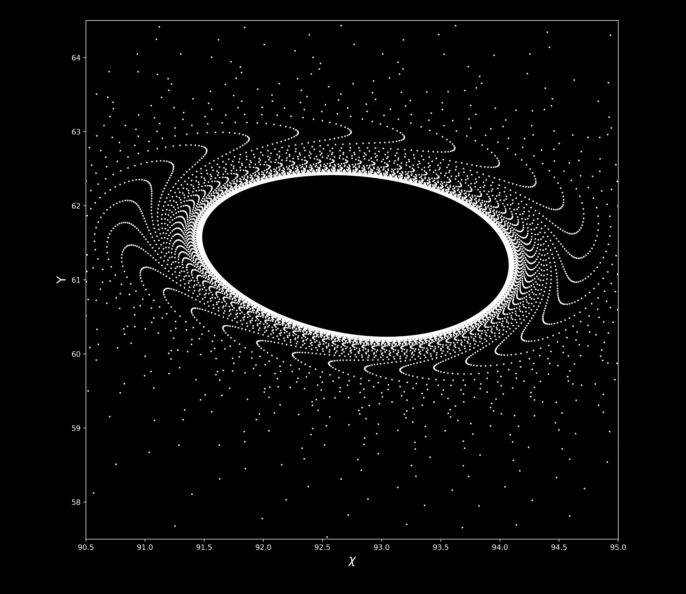

# ODEpy

<br>
python package for graphing systems of ODEs

## running the code
### inline notebook (recommended for non jupyter notebook users)
```python
%matplotlib inline
```
### interactive notebook (recommended for jupyter notebooks)
```python 
%matplotlib notebook
```
```python
# import packages
from ODEpy import *
# define constants
l = (28., 10., 8./3.)
# integrate
X, Y, Z = ODEpy(lorenz_system, 1.,1.,1., l, 200000, .001)
# plot
ODEplot(X,Y,Z, size = .02, alpha = .5, alt = 0, az = 0)
```

